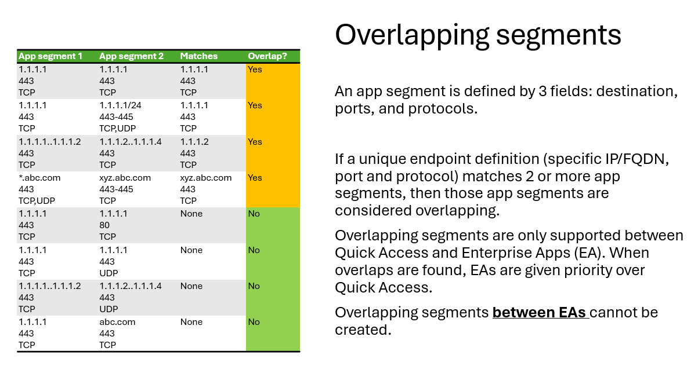
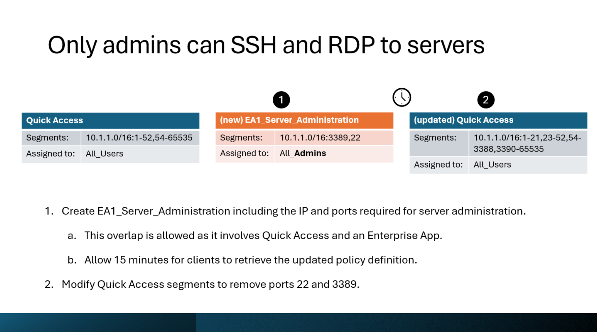
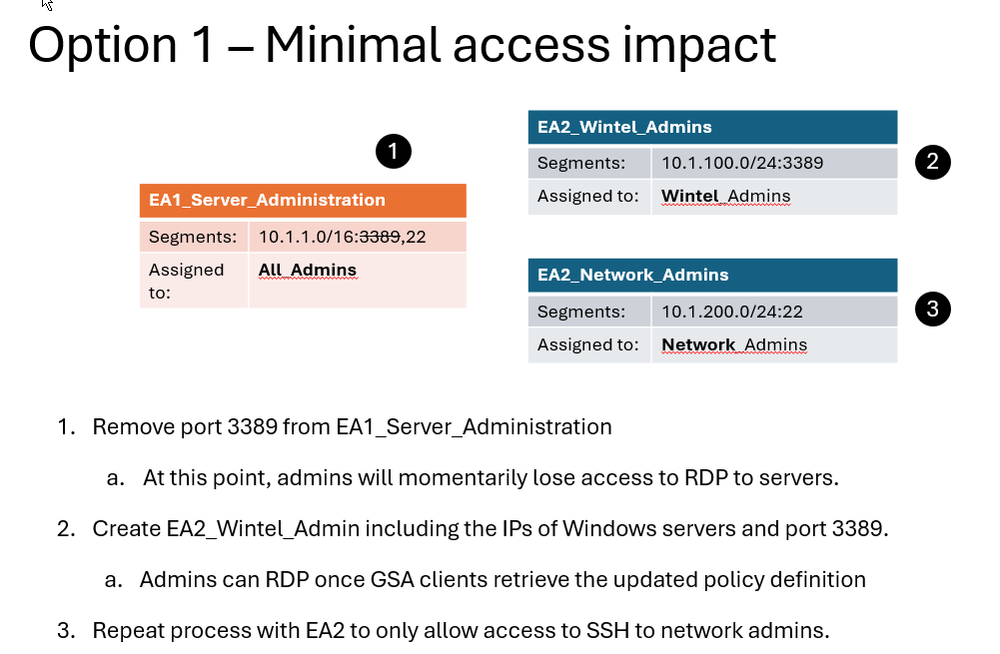
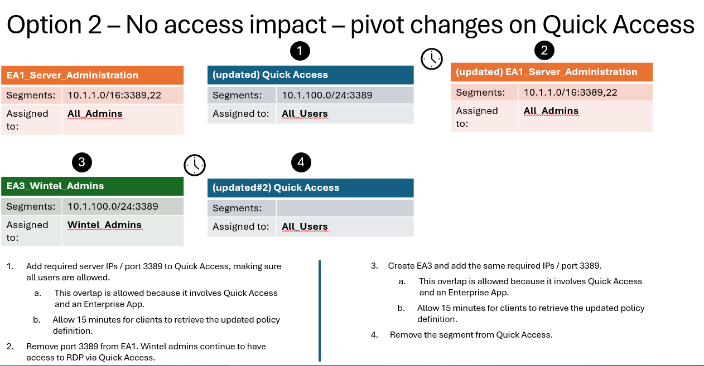

After configuring the VPN Replacement scenario providing broad access to on-premises resources, you are in a position to start segmenting access.
Segmenting access allows the organization to provide specific network access based on used needs. 
Here is an example of network access segmentation made possible by Private Access: 

* Only users in the Finance team need access to the Web server finance.contoso.local, hosted by a single web server at 10.1.1.100:443
* Only the Wintel admins need access to perform remote administration via RDP, so they are allowed access to 10.1.1.100:3389

This deck walks through strategies for segmenting access after configuring Private Access as VPN replacement.\
[Private Access Segmentation Strategy](https://github.com/microsoft/GlobalSecureAccess/blob/main/website/content/PA%20-%20Segmentation%20Strategy.pptx)

### Overlapping segments
Private Access allows overlapping between segments defined on *Quick Access* and *Enterprise Apps*. Overlapping segments between Enterprise Apps cannot be configured.
If a segment defined on an Enterprise App (for example 10.1.1.1:3389) overlaps with a segment defined on Quick Access (for example 10.1.1.0/24:3389), then the segment defined on the Enterprise App will be given priority by the GSA client. This means that if a user is trying to RDP to 10.1.1.1 (as defined by the Enterprise App), the access will be evaluated according to the user and group assignment on that app and not Quick Access. Similarly, Conditional Access policies enforced to the Enterprise Apps will also be enforced.

### Segmentation strategy

Here are the steps to segment access from Quick Access configured to provide broad access to resources:
1. Create a new Enterprise Application that defines access to the application or resource you want to segment access for. Private Access allows overlapping segments between Quick Access and Enterprise Apps. Segments defined on Enterprise Apps are given higher priority to those defined on Quick Access.
2. Assign your newly created Enterprise App to the users that should be allowed to access.
3. Allow for a minimum of 15 minutes so your configuration changes are delivered to GSA clients.
4. As a best practice, remove the segments that have been defined on your newly created Enterprise App from your Quick Accesses segment configuration. This might require breaking IP subnets into smaller ranges such as the exclusion is possible.

### Segmenting Access defined by an Enterprise App
If you need to further segment access defined by an Enterprise App, the process looks different. You have 2 options depending on the tolerance for user access disruption.

