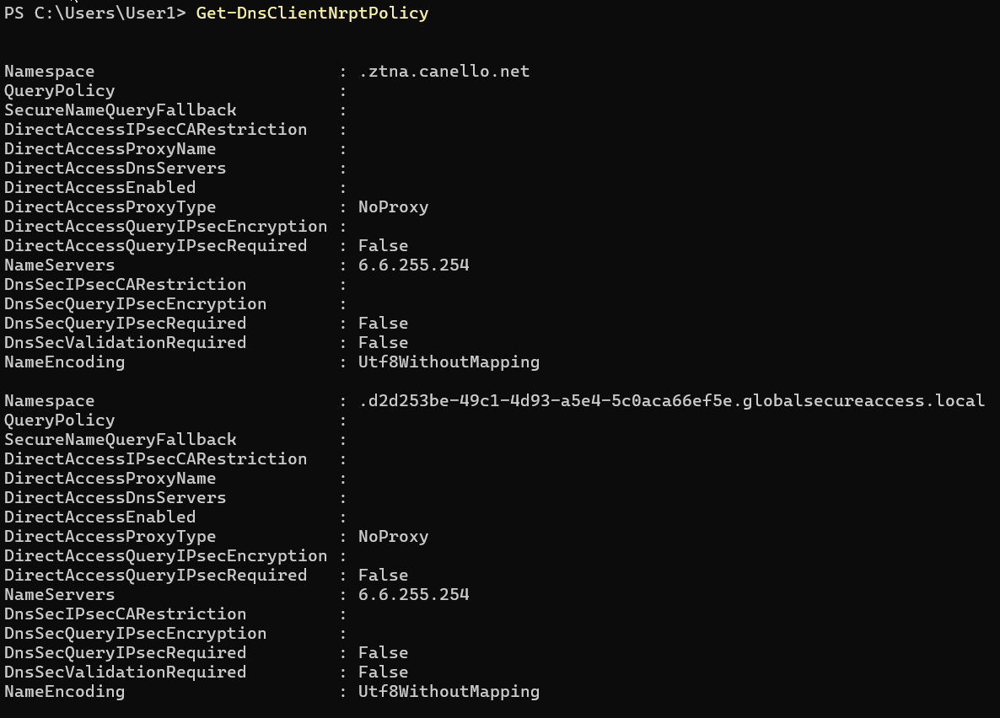
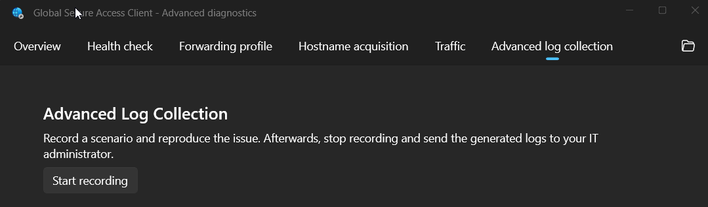

### Is the client connecting?
Check the client is successfully connector to all the channels by double-clicking on the tray icon.
Use the Health Check tab to troubleshoot known problems: https://learn.microsoft.com/entra/global-secure-access/troubleshoot-global-secure-access-client-diagnostics-health-check

Also note known limitations here: https://learn.microsoft.com/entra/global-secure-access/how-to-install-windows-client

### Is traffic being acquired by the client?
The Advanced Diagnostics / Traffic tool is a great way to understand why things might not be working.
Start the traffic collection, reproduce what you are trying to do and observe the traffic tab activity.
If you know the target IPs and ports your app should be connecting to, filtering by those will remove unrelated traffic and make the troubleshooting easier, for example you could add a filter "Destination Port == 3389" if you are troubleshooting RDP connections.


Note the default filter "Action==Tunnel" applied, the fact you are seeing a line (or flow) here means the GSA client is:
* Seeing the traffic
* Evaluating the protocol, destination IP/FQDN and port against the Traffic Forwarding rules, and determining the traffic should be tunnelled to the GSA service.

If the destination IPs or ports are not know, you can try filtering by process name, using the above example, you could filter by process name "mstsc.exe".

### Other reasons traffic might be bypassed
The Internet Access and Microsoft Traffic Forwarding profiles have the option to configure bypass rules to defined destinations that must not be handled by GSA clients. This is another reason traffic might not be acquired and tunnelled by the GSA client.


### What if I do see some traffic but things still don't work?
Applications might require connectivity to different services with multiple destination IPs, ports or that use UDP or TCP protocols.
It's common to have scenarios where app segments (seen on the client as rules under Forwarding Profiles) have been created to tunnel traffic needed by applications but some destinations have been missed.
In this case, if the application process name is known, you can try filtering by the process name and **removing the default Action==Tunnel** filter to be able to spot else the app is trying and being missed by existing rules.

In this example, an RDP connection has been successfully created and tunnelled by the client, however the user reported performance problems. By removing the default Action==Tunnel filter, adding a process name filter and reproducing the issue, we can observe mstsc.exe is trying to send traffic to the RDP server on 3389/UDP, but the GSA client has determined the traffic needs to be bypassed because it doesn't match a forwarding profile rule.


In some cases, is not as easy to spot missing traffic because the process initiating the connection is not the application process. A common example is authentication traffic.
Your application traffic might be being tunnelled correctly, however the app fails because of authentication failures.
In these cases, you might need to add filters to eliminate unrelated traffic from the collection to make it easier to spot what else is happening and potentially being bypassed by the GSA client.

In this example, a user is accessing a file share from a Windows 11 device. Things to note:
* Windows is trying SMB over QUIC, which uses 443/UDP
* lsass.exe (Local Security Authority process) is initiating connections to domain controllers on port 88/TCP (Kerberos)
* In this case the authentication traffic is being tunnelled because the corresponding rules have been created. If this was not the case, Windows will generally fall back to NTLM which doesn't require additional ports, but this might not be the case depending on configuration.
* Additionally, we see a connection on 445/TCP, this is the SMB protocol used for file share access.


### Packets "not seen" by the GSA client
In some cases, you might see the following behavior where traffic is acquired by the GSA client but no outbound packets are seen. Note bytes sent is 0.
One reason you might see this behavior is when a Windows Firewall rule has been configured to drop/block specific traffic. In the example above, a Windows Firewall rule was blocking RDP.


### How does DNS work with GSA?
The GSA client has generally two ways to work with FQDNs.
If rules (app segments) have been created using FQDNs, then the client will intercept DNS query responses sent to the DNS server defined on the device (usually via DHCP). If the query (for example fs.contoso.local) matches a rule, irrespective of the result (i.e.: user at home won't typically be able to resolve corporate network names) the GSA rewrites the query response to a dynamic synthetic IP (6.6.x.x). Then, if the destination protocol and port matches a rule, the traffic will be tunnelled and resolved later on by the GSA cloud service (for Internet traffic) or by a Private Network Connector (for Private Access).

If Private DNS is being used, things get more interesting.
For each private DNS suffix configured, the GSA client adds an NRPT rule to direct those queries to a synthetic IP (usually 6.6.255.254). NRPT stand for Name Resolution Policy Table, and is a Windows feature that allows defining custom DNS servers that should be used for specific DNS suffixes, for more info see: https://learn.microsoft.com/previous-versions/windows/it-pro/windows-server-2012-r2-and-2012/dn593632(v=ws.11).
GSA uses NRPT policies to direct all name resolution for Private DNS suffixes to a specific server. These queries will be tunnelled and ultimately resolved by a Private Network Connector onpremises using the DNS server configured on the server.

To check NRPT rules, run Get-DnsClientNrptPolicy. In this example, we see two NRPT policies that were created by GSA.
* One for a suffix configured on Private DNS
* Another one used to send unqualified names (aka single label) through the tunnel. The GSA client also adds a DNS search suffix for AppId.globalsecureaccess.local


Once queries have been resolved, GSA continues with the IP/port/protocol evaluation to determine if the traffic should be acquired and tunnelled.

To troubleshoot DNS resolution, use:
* Resolve-DnsName, this PowerShell command follows NRPT rules.
* NSLOOKUP does not follow NRPT rules, so to force queries via the tunnel, use "nslookup fs.contoso.local 6.6.255.254"

For more advance troubleshooting and to understand what DNS servers are being used, queries being send while certain activity is generated (for example trying to open a file share), and responses, use the DNS Client log provider:
* Run "wevtutil sl Microsoft-Windows-DNS-Client/Operational /enabled:true" to enable the provider. (remember to disable once you finish troubleshooting)
* After reproducing your issue, you can simply use PowerShell to filter and display the relevant logs. In this example we are getting logs from the last 3 minutes, filtering by queries containing contoso.local.

```powershell
$StartDate = (Get-Date).AddMinutes(-3) ; Get-WinEvent -FilterHashtable @{LogName='Microsoft-Windows-DNS-Client/Operational';StartTime=$Startdate} | where Message -Match contoso.local | Out-GridView
```

### Known issue: Private DNS 'flaky' resolution
 There is a known issue where DNS names that should be resolved via Private DNS fail and work on retry, typically causing application access issues.
 
 Troubleshooting:
 * Force IPv4 only name resolution from the client side, either using ping -4 fqdn or Resolve-DnsName -Type A - Name fqdn. If this provides stable name resolution, you might be hitting this issue.

Workaround:
Disable IPv6 on your client machine (where GSA client runs) *AND* on your connector/s servers. *It's important to disable IPv6 on both.*

[Guidance on disabling IPv6 on Windows](https://learn.microsoft.com/troubleshoot/windows-server/networking/configure-ipv6-in-windows#:~:text=will%20be%20preferred.-,Disable%20IPv6,-Decimal%20255%0AHexadecimal)

### Private Access resource access fails
There are multiple reasons Private Access resources might not work correctly. Here are some troubleshooting steps you can follow.

Capture traffic using the Advanced Diagnostic tool and make sure the flows are acquired and tunnelled.
Get the "Correlation vector ID" and use it to look up GSA Traffic Logs on the Entra portal. Traffic logs show what connector handled the traffic and if errors occurred.

If there are no errors on Traffic Logs pointing at problems communicating with Private Network connectors, the next step would be obtaining and analysing a network capture to see the actual conversations going through the tunnel. See the next section on how to get this.


### How to get GSA client logs
There are two ways to get logs, and they depend on whether you can reproduce the issue or not.

If the issue can be reproduced, then the best way to collect logs is by opening Advanced Diagnostics, selecting Advanced Log Collection, and clicking Start Recording. Reproduce your issue, then click Stop Recording.


Advanced Log Collection gathers diagnostic information from the device including network configuration, registry settings, GSA forwarding profile configuration, and **a network capture (pcap) of the traffic being sent via the tunnels**. This capture makes troubleshooting connectivity issues easier. Client versions after 2.2.158 have also added DNS Client logs, which as useful for diagnosing authentication issues as described above.

For times when the issues cannot be reproduced at will, you can instruct users to simply right-click the GSA tray icon and click Collect Logs. This log collection will include the same diagnostic information as Advanced Log Collection, except the tunnel network capture. Both include ETL tracing that allows you to load the logs in other device for analysis.

### How to analyse GSA client logs on a different device
After collecting the logs, they can be loaded on a different device with the GSA client by clicking the following option on the Advanced Diagnostic tool:


This will give you the ability to load the zip file collected from a different device or the GlobalSecureAccess-Trace.etl file which contains flow diagnostic information. The benefit of loading the zip file is that the tool will also load tenant ID, device ID, client version, health check, forwarding profile rules, etc. just like if you were troubleshooting locally on the device.

