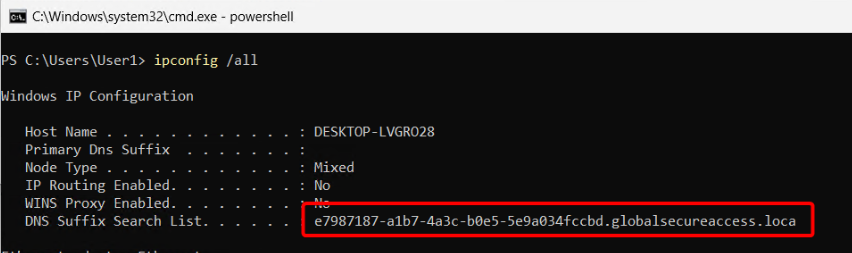

This is a list of known issues you might hit while working with Global Secure Access. We'll keep this list updated and note when issues have been fixed.

### Truncated GSA DNS search suffix leads to flaky Private DNS resolution

As described on the [Windows Troubleshooting section](./GlobalSecureAccessClients/WindowsClientTroubleshooting.md) "How does DNS work with GSA?", GSA adds a DNS search suffix to the device (and a matching NRPT rule) to be able to handle short name resolution by directing these queries through the PA tunnel.

Because of a bug, the DNS search suffix GSA adds, might have an invalid character at the end as reported by `ipconfig /all`

Note the missing `l` at the end. Once this truncated suffix is appended, the names fail to be sent through the PA tunnel because the suffix doesn't match the NRPT policy. As a result, DNS queries are sent to the local DNS server instead of the Private Access tunnel and ultimately your connector on-prem.

Workaround: use GPO or Intune to set your DNS search suffix list to the appropriate suffixes.