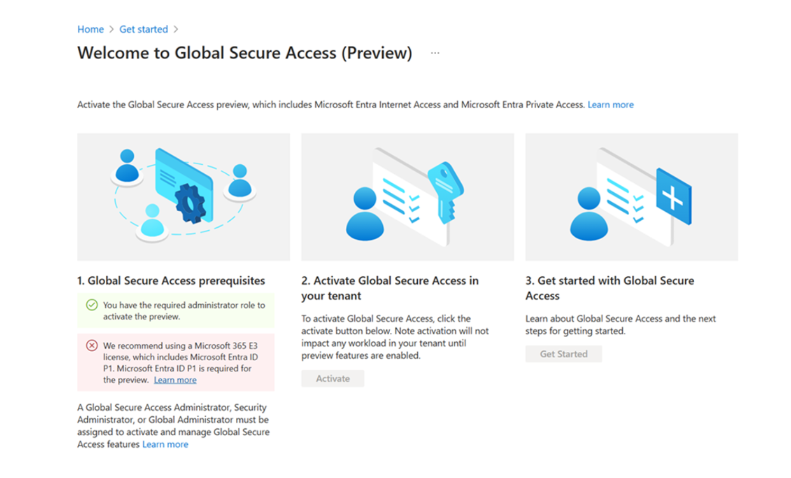

## Configure initial product

Follow the steps in this section to configure SSE through the Microsoft Entra admin center and install the Global Secure Access Client on your Windows 10/11 client device.

### Configure Microsoft SSE through the Microsoft Entra admin center

Activate Microsoft SSE through the Microsoft Entra admin center and make initial configurations that are requirements for this PoC.

1. Open the [Microsoft Entra admin center](https://entra.microsoft.com) using an identity assigned the [Global Secure Access Administrator](https://learn.microsoft.com/entra/identity/role-based-access-control/permissions-reference#global-secure-access-administrator) role.
2. Go to **Global Secure Access** > **Get started** > **Activate Global Secure Access in your tenant**. Select **Activate** to enable SSE features in your tenant.

3. Go to **Global Secure Access** > **Connect** > **Traffic forwarding**. Turn on **Microsoft profile**, **Private access profile**, and **Internet access profile**.
Traffic forwarding enables you to configure the type of network traffic to tunnel through the Microsoft's Security Service Edge Solution services. You set up [traffic forwarding profiles](../global-secure-access/concept-traffic-forwarding.md) to manage types of traffic. The **Microsoft traffic profile** is for Microsoft Entra Internet Access for Microsoft Traffic. Microsoft's Security Service Edge solution only captures traffic on client devices that have Global Secure Access Client installed.

   > When you enable the Internet Access forwarding profile, you should also enable the Microsoft traffic forwarding profile for optimal routing of Microsoft traffic.

4. Enable source IP restoration, go to **Global Secure Access** > **Connect** > **Settings** > **Session management** > **Adaptive Access** and turn on **Enable Global Secure Access signaling in Conditional Access**. Source IP restoration is required to for Conditional Access policies that you will configure as part of this proof of concept.

### Install Global Secure Access Client on your Windows 10/11 client device

Microsoft Entra Internet Access for Microsoft Traffic and Microsoft Entra Private Access use the Global Secure Access Client on Windows devices. This client acquires and forwards network traffic to Microsoft's Security Service Edge Solution.

1. Make sure your Windows device is Microsoft Entra joined or hybrid joined.
2. Sign in to the Windows device with a Microsoft Entra user role that has local admin privileges.
3. Open the [Microsoft Entra admin center](https://entra.microsoft.com) using an identity assigned the Global Secure Access Administrator role.
4. Go to **Global Secure Access** > **Connect** > **Client Download**. Select **Download client** and complete the installation.

 
5. In the Window taskbar, the Global Secure Access Client first appears as disconnected. After few seconds, you'll be prompted to sign in.

6. In the Window taskbar, double-click the Global Secure Access Client icon and verify **Connected** status.

7. In the Window taskbar, right-click the Global Secure Access Client.

8. Select **Advanced Diagnostics** to view **Global Secure Access Client Connection Diagnostics**. Click **Health check** and verify that all checks show **Yes** status.
